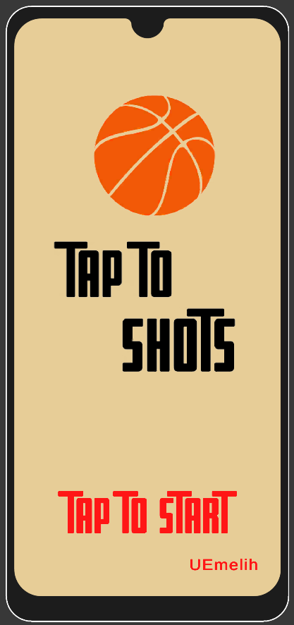
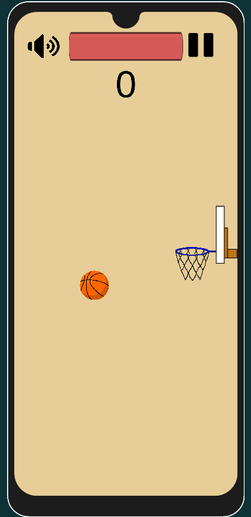
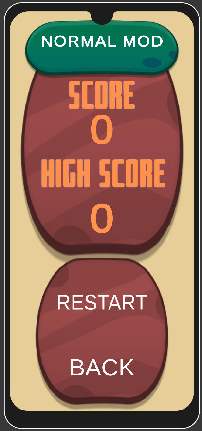
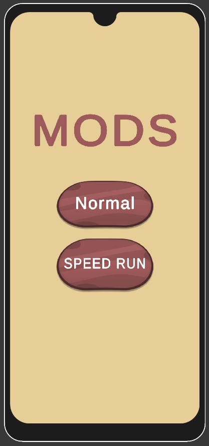

# Tap To Shots

## Project Description
In this project, I developed a simple basketball shooting game. After pressing the start button, you have to throw the basketball into the basket before the time runs out. There are 2 different modes in the game. In normal mode, the time decreases at a certain rate. In accelerated mode, the time decreases faster each time you score. When the time is up, your current score and your highest score will be displayed. The restart button will appear and the game will restart when it is clicked.

## Table of Contents

- [Project Description](#Project-Description)
- [Play Demo and Installation](#Live-Demo-and-Installation)
- [Game Screen](#Game-Screen)

## Play Demo and Installation
https://melih-kir.itch.io/tap-to-shots

## Game Screen

  
  
  
  <animated-image data-catalyst="" style="width: 22%;">
      
        <a data-target="animated-image.replacedLink" class="AnimatedImagePlayer-images" href="https://github.com/alihandgrmnclr/Vue-TodoApp/blob/main/public/readme-assets/app.gif" target="_blank">
          
            
          <canvas class="AnimatedImagePlayer-stillImage" aria-hidden="true" width="183" height="361"></canvas>
        </a>
        <button data-target="animated-image.imageButton" class="AnimatedImagePlayer-images" tabindex="-1" aria-label="Play app.gif"></button>
        
          <button data-target="animated-image.playButton" class="AnimatedImagePlayer-button" aria-label="Play app.gif">
            <svg aria-hidden="true" focusable="false" class="octicon icon-play" width="16" height="16" viewBox="0 0 16 16" fill="none" xmlns="http://www.w3.org/2000/svg">
              <path d="M4 13.5427V2.45734C4 1.82607 4.69692 1.4435 5.2295 1.78241L13.9394 7.32507C14.4334 7.63943 14.4334 8.36057 13.9394 8.67493L5.2295 14.2176C4.69692 14.5565 4 14.1739 4 13.5427Z">
            </path></svg>
            <svg aria-hidden="true" focusable="false" class="octicon icon-pause" width="16" height="16" viewBox="0 0 16 16" xmlns="http://www.w3.org/2000/svg">
              <rect x="4" y="2" width="3" height="12" rx="1"></rect>
              <rect x="9" y="2" width="3" height="12" rx="1"></rect>
            </svg>
          </button>
          <a data-target="animated-image.openButton" aria-label="Open app.gif in new window" class="AnimatedImagePlayer-button" href="https://github.com/alihandgrmnclr/Vue-TodoApp/blob/main/public/readme-assets/app.gif" target="_blank">
            <svg aria-hidden="true" class="octicon" xmlns="http://www.w3.org/2000/svg" viewBox="0 0 16 16" width="16" height="16">
              <path fill-rule="evenodd" d="M10.604 1h4.146a.25.25 0 01.25.25v4.146a.25.25 0 01-.427.177L13.03 4.03 9.28 7.78a.75.75 0 01-1.06-1.06l3.75-3.75-1.543-1.543A.25.25 0 0110.604 1zM3.75 2A1.75 1.75 0 002 3.75v8.5c0 .966.784 1.75 1.75 1.75h8.5A1.75 1.75 0 0014 12.25v-3.5a.75.75 0 00-1.5 0v3.5a.25.25 0 01-.25.25h-8.5a.25.25 0 01-.25-.25v-8.5a.25.25 0 01.25-.25h3.5a.75.75 0 000-1.5h-3.5z"></path>
            </svg>
          </a>
        
      </animated-image>

